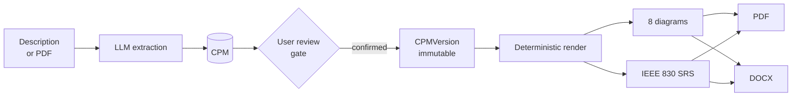

# AI Software Architect

Turns a project description into a **submission-ready deliverable**: eight UML/ER
diagrams and a formatted IEEE 830 software requirements specification, exported
as PDF and DOCX in the template your department mandates.

The unit of value is a **finished document set**, not a diagram. Competitors sell
diagram editors; this sells the thing you hand in.

**Primary user:** an engineering student who must submit an SRS and a fixed UML
set in a university template. Time-poor, format-anxious, price-sensitive.

---

## The one architectural rule 

Everything is rendered from the **Canonical Project Model (CPM)**.



The LLM runs **once**, to build the CPM. After the user confirms it, every
diagram and every document section is rendered *from the CPM*. No artefact is
ever produced by a separate model call that bypasses it.

This is what guarantees cross-diagram consistency, which is the entire product
differentiator. Violating it silently destroys the product — so a test asserts
that no mapper imports an LLM client, and another asserts that no model
identifier appears anywhere outside the gateway module.

---

## What it produces

| | |
|---|---|
| **Diagrams** | Class, Use Case, Sequence, Activity, State, Component, Deployment, Entity-Relationship |
| **Document** | IEEE 830-1998 SRS — numbered sections, contents, list of figures/tables, glossary, per-use-case functional requirements |
| **Formats** | PDF (vector diagrams, selectable text) and DOCX (real Word styles, editable) |
| **Templates** | Three built in; a fourth is a JSON file, not a deploy |

A generated 8-diagram document is 18 pages and takes **7.4 seconds** end to end
against a 180-second budget.

---

## Quick start

Requires Docker and Docker Compose. Nothing else — no Python or Node on the host.

```bash
cp .env.example .env
```

Set one value in `.env` (everything else has a working local default):

```bash
python -c "import secrets; print(secrets.token_urlsafe(32))"
```

Put that in `ASA_SIGNING_SECRET`, then bring the stack up:

```bash
make dev
```

Create the schema:

```bash
docker compose exec api alembic upgrade head
```

Verify it works end to end:

```bash
make at1
```

```
  PASS   1. CPM entities                                 8
  PASS   2. CPM relationships                            9
  PASS   3. Eight diagrams render                        8 of 8 rendered
  PASS   4. Every rendered diagram is syntactically valid 8 valid, 0 rejected
  PASS   5. Entity naming byte-identical across every diagram 99 names, 0 mismatches
  PASS   6. PDF page count                               18 pages
  PASS   7. All eight present as numbered, captioned figures 8 figures
  PASS   8. Cover page carries the project name and author
  PASS   9. Index entries match the real section and figure numbering
  PASS  10. DOCX text matches PDF text
  PASS  11. Total wall time                              7.4s
  11 passed, 0 failed  ·  wall time 7.4s of 180s budget
```

> **`make down` deletes your data.** It passes `-v`, which removes the Postgres
> volume. Use `docker compose down` to stop the stack and keep it.

---

## Using the API

No sign-in step — a single-user local tool has no one to authenticate a
caller against.

```bash
curl -sX POST localhost:8000/projects/my-project/review/seed \
  -H 'content-type: application/json' -d '{}'
```

| Endpoint | Purpose |
|---|---|
| `POST /projects/{id}/review/seed` | Put a model into review |
| `GET  /projects/{id}/review` | Current draft, validation issues, confirmable |
| `POST /projects/{id}/review/edit` | One structural edit (renames cascade) |
| `POST /projects/{id}/review/confirm` | The FR-6 gate → immutable `CPMVersion` |
| `POST /runs` | Queue a generation run (202) |
| `GET  /runs/{id}` · `/events` | Status; server-sent progress stream |
| `POST /runs/{id}/regenerate` | FR-12 — redraw one diagram |
| `GET  /runs/{id}/history` | What was regenerated, and when |
| `GET  /runs/{id}/artefacts` | Signed, expiring links to each diagram |
| `POST /runs/{id}/export` | Queue a PDF/DOCX (202) |
| `GET  /runs/exports/{id}` | Export status + signed download link |
| `GET  /metrics` · `/metrics.json` | Funnel dashboard (no third-party SDK) |

---

## Architecture

```
├── api/          FastAPI — HTTP surface, alembic migrations
├── worker/       arq workers — every generation stage runs here, never in a request
├── web/          Next.js + TypeScript + Tailwind + shadcn/ui
├── shared/       everything both api and worker need — one definition, imported twice
│   ├── cpm/            the model, its JSON Schema, integrity rules, fixtures
│   ├── llm/            the gateway — the ONLY module that knows a model name
│   ├── extraction/     description → CPM, with a fabrication floor
│   ├── diagrams/       mappers (one per type), engines, renderer
│   ├── consistency/    the FR-10 validator
│   ├── generation/     run orchestration, regeneration, export
│   ├── review/         edit operations, the confirm gate
│   ├── srs/            document AST, IEEE 830 layout, templates, PDF + DOCX exporters
│   ├── analytics/      funnel events, metrics, dashboard
│   └── store/          SQLAlchemy models shared by both services
└── acceptance/   AT-1 — the end-to-end definition of "V1 works"
```

**Services:** `postgres` · `redis` · `plantuml` · `kroki` (Mermaid, opt-in
profile) · `api` · `worker` · `web`

**Stack is fixed:** Next.js/TypeScript/Tailwind/shadcn, FastAPI, PostgreSQL
(JSONB for CPM payloads), Redis + arq, S3-compatible storage, PlantUML primary
with Mermaid secondary. PlantUML is a hard dependency — Mermaid cannot render use
case, component, deployment, object, communication or timing diagrams.

**The LLM is free and local by default.** `qwen2.5:7b` via Ollama: no API key, no
quota, and nothing leaves the machine — which makes "your content is never used
for training" true by construction rather than by a provider's promise.

---

## The guarantees, and how each is held

These are not aspirations. Each has a test that fails if it stops being true, and
several have a planted-regression check proving the test is not vacuous.

| | Guarantee | How it is held |
|---|---|---|
| **C-2** | No model identifier outside the LLM gateway | Repo-wide scanner over every `.py` file |
| **C-3** | No artefact bypasses the CPM | AST walk: no mapper imports an LLM client or `httpx` |
| **C-4** | No generation in the HTTP request cycle | `POST /runs` returns 202 in ~17ms; export in ~30–67ms |
| **FR-6** | Generation blocked until the user confirms | Type-enforced: `confirm_draft` is the only bridge from `CPMDraft` to `CPM` |
| **FR-7** | A confirmed version is immutable | Postgres `RULE`s — `UPDATE`/`DELETE` are no-ops |
| **FR-9** | Identical CPM ⇒ identical output | Golden-file tests, byte for byte |
| **FR-10** | Entity names byte-identical everywhere | Validator runs unconditionally; an AST guard fails the build if the call is ever put inside an `if` |
| **FR-11** | Diagram source validated before it is shown | Engine round-trip, one retry, failure contained to one figure |
| **FR-12** | Regenerate one diagram, not the set | Child run carries the rest forward; an unchanged model is *reported*, not silently redrawn |
| **FR-16** | Every diagram embedded, numbered, captioned | An unplaced diagram type lands in an appendix rather than vanishing |
| **NFR-S3** | Uploads are data, never instructions | Delimited, with neutralisation of the closing token |
| **NFR-S4** | Download links signed and expiring | HMAC over id + deadline, constant-time compare |
| **NFR-Q4** | No unresolved placeholder survives | Asserted over every string in the document AST |

### Two design decisions worth reading

**The document AST is a real layer.** `shared/srs/ast.py` knows about sections,
figures and cross-references and nothing about DOCX or PDF — a test fails if it
ever imports a rendering library. Both exporters are pure functions of that tree,
so neither format can become a byproduct of the other. AT-1 checks this by
extracting the text of both files and verifying that every word of the DOCX
appears in the PDF in the same order, the only permitted extras being list
markers and text drawn inside vector figures.

**Cross-references are references, not strings.** A sentence holds
`FigureRef("fig-class")`, never `"Figure 3"`, and takes its number from the same
pass that numbers the figure. Move a figure and the sentence follows it.

---

## The review gate metric

The most important number in the product, and the one most easily misread.

A user confirming with **zero edits** means either *extraction was excellent* or
*they did not look* — identical outcomes demanding opposite responses. Nothing
about the outcome can separate them, so the review screen ships evidence of
attention with the confirmation: active seconds (idle excluded), coverage (how
much of the model was actually brought into view), and inspections.

Confirmations land in four buckets — `edited`, `verified`, `rubber_stamped`,
`unknown` — with the time bar scaled to model size, because twenty seconds is
attentive for three entities and derisory for forty. Neither signal alone
suffices: a screen left open over lunch and a two-second scroll to the bottom
both come back `rubber_stamped`.

Raw signals are stored beside the verdict, so history can be re-classified once
the thresholds are validated against real users.

---

## Testing

```bash
make test    # 575 shared + 3 api + web suites
make at1     # the end-to-end acceptance test (needs a live stack)
make lint    # ruff, plus generated-file drift checks
```

`make at1` prints a checklist, not a stack trace. A failure names the assertion,
what was expected, what was found, and — where the cause is known — what to do
about it, because a traceback tells you where Python gave up rather than which
promise broke.

Tests for the CPM and the consistency validator are written **before** the
implementation. Diagram renders are never mocked.

---

## Templates

Templates are **data**. Adding one is a JSON file in
`shared/srs/template/builtin/`, read at call time, with no deploy and no code
change — a test writes an invented template to a temp path and renders both
formats from it.

The schema was designed against the two most *dissimilar* real formats, not the
two easiest:

| | Bound project report | Course hand-in |
|---|---|---|
| Page | A4, 38.1mm binding margin, mirrored | US Letter, 25.4mm all round |
| Body | Times 12pt, 1.5 spacing, justified | Calibri 11pt, 1.15, left |
| Sections | `Chapter 1`, new page each | `1`, running on |
| Figures | `Fig. 3.2` — restarts per chapter | `Figure 7` — document-wide |
| Front matter | Cover **+ certificate with signature blocks** | Cover |
| Index | Bordered `Sr. No. / Chapter / Page No.` table | Dotted contents + LoF + LoT |
| User fields | 8, including a logo upload | 3 |

Every difference above is a config value. A test parses the applier's AST and
fails if it ever names a template id in code.

---

## Make targets

| | |
|---|---|
| `make dev` | Build and start the full stack |
| `make down` | Stop **and delete volumes** — use `docker compose down` to keep data |
| `make test` | api, shared and web test suites |
| `make at1` | Acceptance test AT-1, end to end |
| `make lint` / `make fmt` | Ruff, plus generated-file drift checks |
| `make types` | Regenerate the CPM JSON Schema **and** the TypeScript types from it |
| `make golden` | Regenerate golden diagram sources, then review the diff |
| `make health` | API dependency health report |
| `make logs` / `make clean` | Tail logs; remove caches |

TypeScript types are **generated, never hand-written** — two `--check` guards in
`make lint` fail if the schema or the generated types drift.

---

## Configuration

Copy `.env.example` to `.env`. Compose supplies local defaults for everything
except `ASA_SIGNING_SECRET`, which has no default on purpose: a committed one
would make every signed URL on the platform forgeable by anyone who read the
source.

To use a real model for extraction, point the gateway at a local Ollama:

```bash
LLM_PROVIDER=ollama
LLM_BASE_URL=http://host.docker.internal:11434
LLM_MODEL=qwen2.5:7b
```

Any OpenAI-compatible server works too (`LLM_OPENAI_BASE_URL`, `LLM_API_KEY`).
The model name appears in exactly one file, and a test keeps it that way.

---

## Current status

Working end to end and covered by tests: extraction, the review gate, all eight
mappers, the consistency validator, selective regeneration, SRS assembly, both
exporters, the template system, and the metrics dashboard.

Known gaps, stated plainly:

- **AT-1 replays extraction.** With no model server reachable, the recorded model
  output is replayed through the *real* gateway and the *real* extraction service
  — schema validation, de-duplication, orphan dropping and the FR-5 floor all
  still run; only the model call is replayed. A replayed run can never print
  `AT-1 PASSED`, whatever the assertions say. Start an Ollama instance and re-run
  to claim it.
- **The shipped templates are archetypes.** They were reconstructed rather than
  collected from real departments, and each declares this in an `origin` field.
  Swapping in genuine ones is what will actually validate the schema.
- **Artefacts live in the database.** A run is under a megabyte, so object
  storage is not yet pulling its weight. The `storage_key` column exists so
  moving to R2 is a backfill rather than a migration of the read path.

### Not in V1 — deliberately

GitHub/ZIP ingestion and AST parsing · team collaboration and comments · version
comparison and drift detection · BPMN, customer journey and cloud architecture
diagrams · HLD/LLD/API docs · AI chat over the project · SSO, on-premise, public
API.

---

## Documents

[`PRD_AI_Software_Architect.md`](PRD_AI_Software_Architect.md) ·
[`SRS_AI_Software_Architect.md`](SRS_AI_Software_Architect.md) ·
[`CLAUDE.md`](CLAUDE.md) — project context and working agreement

---

## Licence

Not yet chosen. Until one is added, all rights are reserved by the author.
